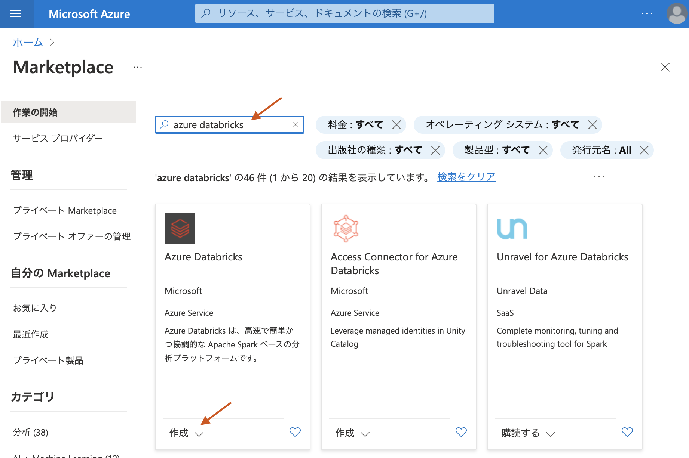
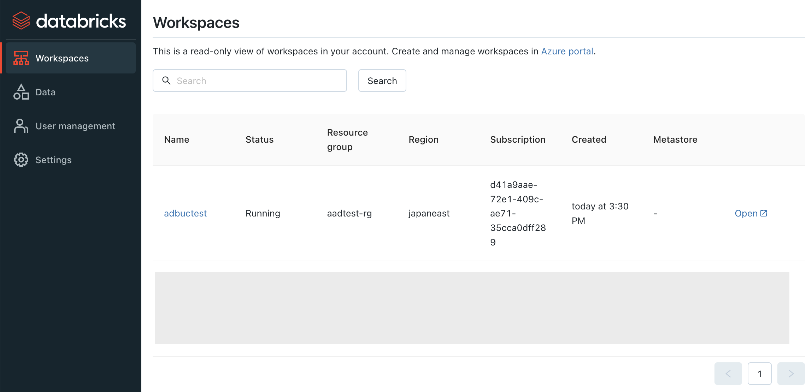
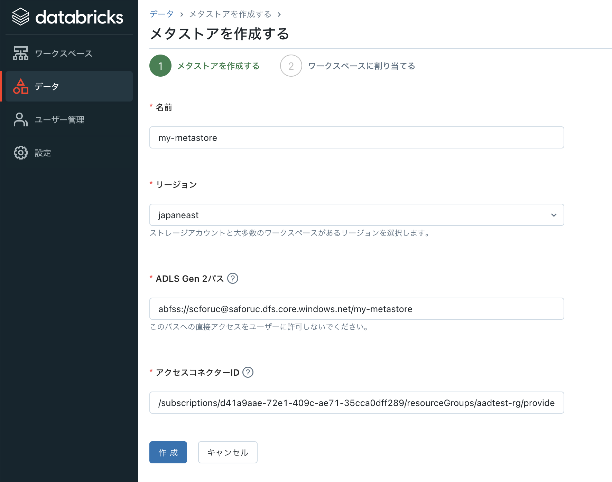
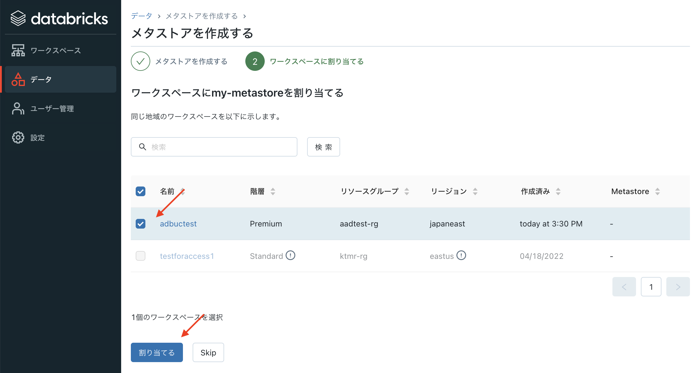
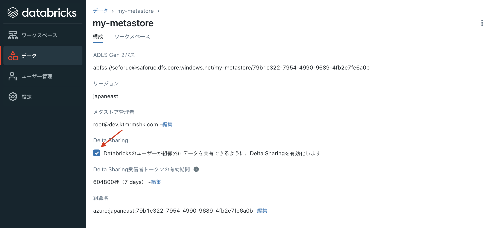
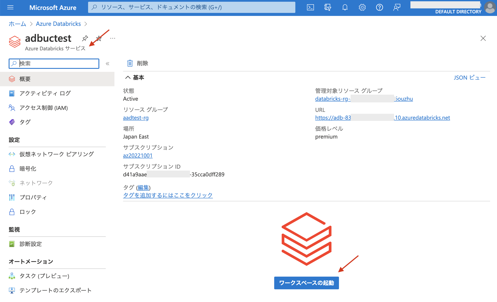
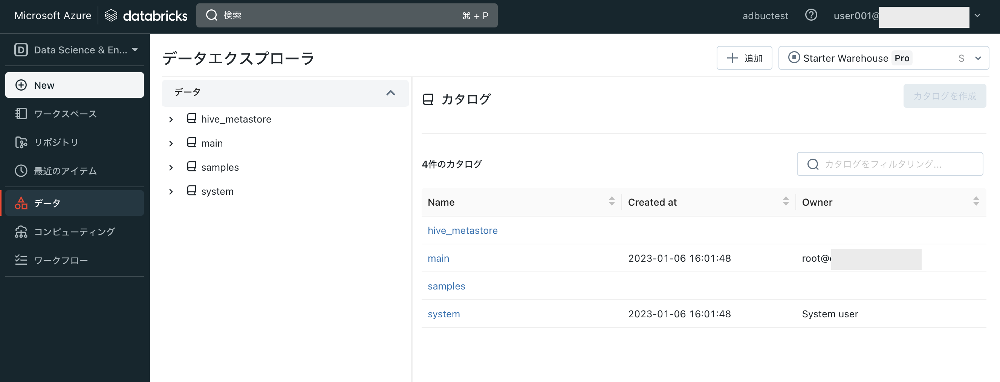
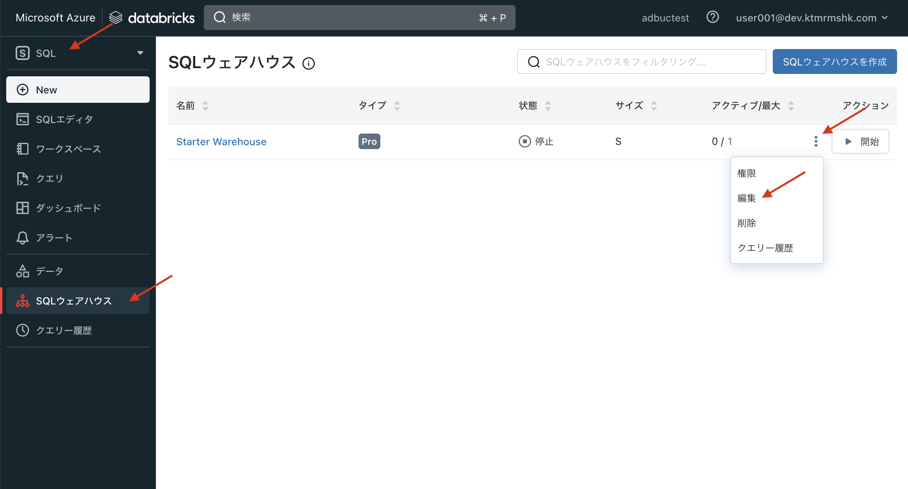
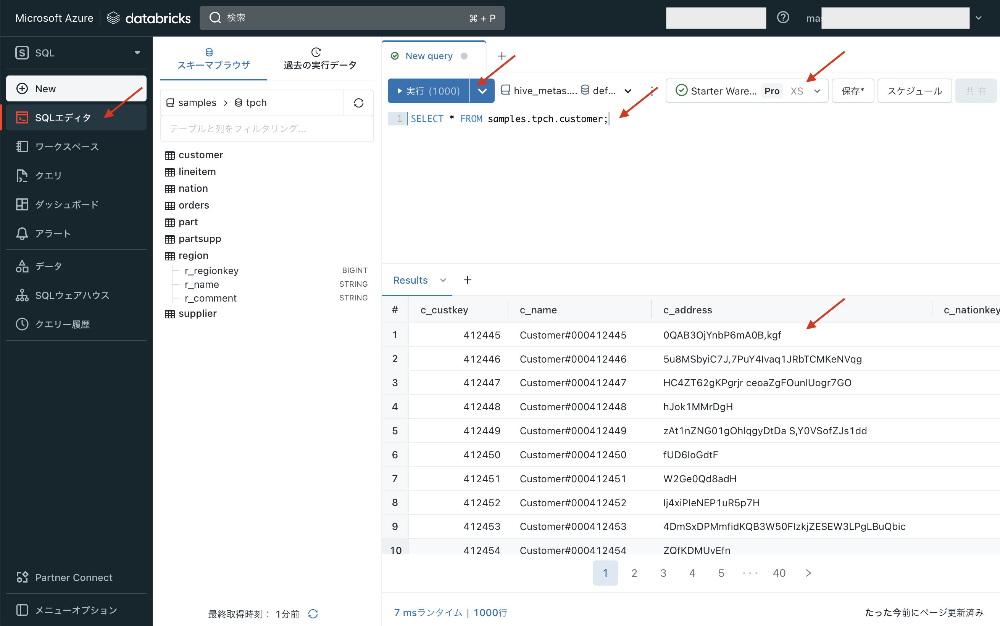

# Databricks SQLのクイックスタートデモ

## シナリオの概要

このクイックスタートは以下の内容をカバーしています。

* Azure Databricksのワークスペースの構築
* ワークスペースでのUnity Catalogの有効化
* Databricks SQL
* ダッシュボードの作成(マネージドRedash)
* ETLとELTのパイプラインの構成


これにより以下のユースケースなどで役に立ちます。

* レイクハウスの構築と実践
* データウェアハウスとしての利用
* ETLとELT
* ローカルデータの取り込み

(最後に書き足す)

# セットアップ

## 1. ワークスペースのデプロイ

> 注意: Azure Databricksのワークスペースを作成するには、Azure Portal上で`Contributor`もしくは`Owner`のAzureロールが必要です。

Azure Portalから以下の内容でAzure Databricksのワークスペースを作成

* 基本
  * 価格レベル: `Premium`
* ネットワーク
  * Secure Cluster Connectivity による Azure Databricks ワークスペースのデプロイ (パブリック IP なし): `いいえ`
  * 自分の仮想ネットワーク (VNet) に Azure Databricks ワークスペースをデプロイします: `いいえ`

* *(上記以外の項目は適宜)* 



## 2. Unity Catalogのセットアップ

[Unity Catalog の使用の開始](https://learn.microsoft.com/ja-jp/azure/databricks/data-governance/unity-catalog/get-started)を参考に実施

### 2.1 メタストア用のADLSを作成

ワークスペースと同じRegionでADLS gen2のアカウント・コンテナを作成する。

### 2.2 マネージドIDを作成

[Unity Catalog で Azure マネージド ID を使用してストレージにアクセスする](https://learn.microsoft.com/ja-jp/azure/databricks/data-governance/unity-catalog/azure-managed-identities)に従って、マネージドIDを作成


その後、上記で作成したADLSアカウントのアクセス制御(IAM)のUIに移動して、`ストレージ BLOB データ共同作成者`ロールとしてマネージドIDを登録する。


### 2.3 (Azure Databricks)のAccount Consoleにログインする

> 注意: Account Console(https://accounts.azuredatabricks.net/login/, Azure Portalとは別)への初回ログインには、テナント(Azure ADロール)のGlobal Administrator(グローバル管理者)の権限を持つユーザーが必要になります。初回は、Global Adminユーザーでログインし、その後、テナント内のユーザーをAccount Adminとして登録することで、その後はGlobal Admin権限は不要になります。

Global Admin権限を持つユーザーで[Azure Databricks Account Console](https://accounts.azuredatabricks.net/login/)へログインする。




> (オプショナル: メニューの日本語化) - 左メニューの`Settings > Language settings`から日本語を選択する


### 2.4 Unity Catalogメタストアの登録

1. Account Console上の左メニュー`データ`に入る。
1. `メタストアを作成する`ボタンをクリックし、以下の項目を入力し`作成`をクリック
  * 名前: 適宜
  * リージョン: ワークスペースのリージョンに合わせる
  * ADLS Gen2 パス: `abfss://<container-name>@<storage-account-name>.dfs.core.windows.net/<metastore-name>`
    - 例) `abfss://democontainer@demoaccount.dfs.core.windows.net/my-metastore
`
  * アクセスコネクターID: 先ほど作ったマネージドIDのリソースID
    - 例) `/subscriptions/12f34567-8ace-9c10-111c-aea8eba12345c/resourceGroups/<resource_group>/providers/Microsoft.Databricks/accessConnectors/<connector-name>`



### 2.5 メタストアをワークスペースにアサインする

(続き)
1. `ワークスペースを割り当てる`のUIで、先ほど作成したワークスペースがリストされているので、チェックボックスを入れて`割り当てる`をクリック




### 2.6 (オプショナル)Delta Sharingの有効化

1. メタストアの詳細ページにある`Delta Sharing`で、`Databricksのユーザーが組織外にデータを共有できるように、Delta Sharingを有効化します`にチェックを入れる。
(デフォルトの有効期限は適宜設定)





## 3. ワークスペースにログインする(確認)


1. Azure Portalから、Azure Databricksリソースから`ワークスペースの起動`をクリックして、ワークスペースにログインする。



1. 画面右上にあるユーザー名をクリック `> User Settings > Language settings`から日本語を選択。その後、左上の`Microsoft Azure`のアイコンをクリックして、ホームページに戻る。
1. 左メニューから`データ`を選択し、以下のようなデータエクスプローラが表示されることを確認する(Unity Catalogが有効化されないと、レガシーなUIのカタログが表示される)。





以上で、ワークスペースとUnity Catalogのセットアップは完了しました。


# Databricks SQLを使う

## SQLウェアハウスを立ち上げる

`SQLウェアハウス`は計算機リソース(VMのクラスタ)で、Databricks SQLでクエリ実行エンジンとして機能する。小さいサイズのSQLウェアハウスを立ち上げてクエリ実行する。

1. Databricksワークスペースにログインする
1. 左上のペイン選択(デフォルトだと`Data Science & Engineering`が選ばれている)で`SQL`を選択する
1. (Databricks SQLモードにページ遷移する)
1. 左メニューから`SQLウェアハウス`を選択する
1. デフォルトで作成されている`Starter Warehouse`の右にあるメニュー(ケバブメニューアイコン)から`編集`をクリックし、以下の項目を設定し`保存`をクリック
    * クラスタサイズ: `X-Small`
    * 自動停止: `10分`
1. `開始`ボタンを押して、ウェアハウスを立ち上げる(立ち上がるまで1-2分程度)



## クエリ実行

(SQLウェアハウスが立ち上がったら)
1. 左メニューから`SQLエディタ`を開く
1. エディタ窓の右上で、先ほど立ち上げたSQL Warehouse(`Starter Warehouse`)を選択する
1. エディタに以下のクエリをコピー&ペーストして`実行`をクリックする
    ```sql
    SELECT * FROM samples.tpch.customer;
    ```
1. 結果のテーブルが下に表れる
(注意: warehouse立ち上げ後は数秒程度遅延が発生する場合があります)



## ローカルのデータ(CSV, JSON)を取り込む
 

## カタログを参照する

## ダッシュボードを作る(Redash)


## 外部のADLS/Blogストレージ上のデータを読み込む

## 外部のRDBMSと連携する


## データ加工のパイプラインを構成する(ETLとELT)

(DLTがUC対応したらそのシナリオを書き足す)

